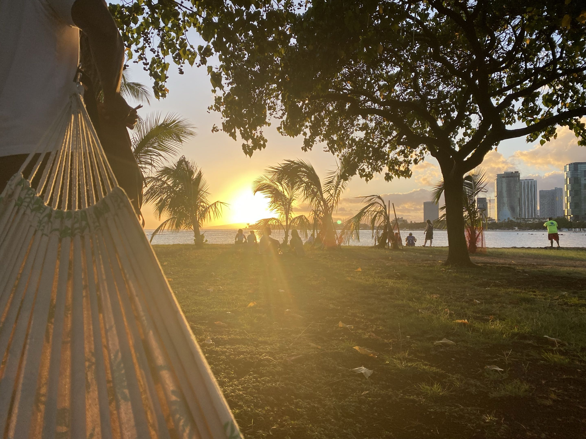

<small>Staring at the sunset on the future that lies ahead of me</small>

**Where It Started**

Growing up, I would play online games until the sun came up, or set an alarm just to get a few hours in before school. What kept me coming back was never only the game itself, but the people in it, and the strange fact that a few thousand lines of code could pull a group of friends into the same world from different houses, different islands, and eventually different time zones. Somewhere in the middle of all those late nights, the question shifted from "what should we play next?" to "how would I build something like this?" That question is what eventually put me in a classroom instead of a lobby.

**The Turn Toward Software**

My first coding class was a couple of years ago, and it did exactly what I did not expect it to do. It made the software I used every day stop feeling like magic. A browser, a game client, a login screen, these all turned into systems that someone designed, argued about, and shipped with bugs still in them. That demystification is what hooked me. I liked that there was always a layer underneath, and that with enough patience I could go look at it. It was the first subject where being stuck for hours felt productive rather than discouraging, because the moment something finally compiled and ran, it was undeniably mine.

**Choosing a Direction**

I know it sounds counterproductive to say this, but almost every field Information and Computer Science touches is one I would like to try to some degree. For a long time my eyes were set on Game Development, and part of me still wants to build that world for my friends. Recently, though, my focus has pivoted toward Cyber Security. Part of that is practical, I believe there will be more openings, more stability, and more room to grow in Cyber Security than in a game industry that is famously hard to break into and harder to stay in. The other part is that Cyber Security scratches the same itch games did. Both are systems with rules, and both reward the person willing to figure out where those rules bend.

**What I Want to Build In Myself**

Over the next few years, the skills I want to develop start with being able to protect myself and the people around me in a digital era that most of us are moving through with our eyes half closed. There are constant threats that people simply are not aware of, and I no longer believe an antivirus program alone is enough. Concretely, I want to get comfortable with networking fundamentals, learn how to read and analyze traffic, understand how common attacks actually work rather than just what they are called, and get hands-on experience through labs, capture-the-flag competitions, and eventually a certification such as Security+. Beyond the technical side, I want the experiences that come with working on a real team, reading code I did not write, giving and receiving honest review, and explaining a technical risk to someone who does not speak the language. I would also like to keep one foot in game development as a personal project, because I think the discipline of finishing something you built for fun is its own kind of training. Wherever I end up, I want to be the person who understands the layer underneath.