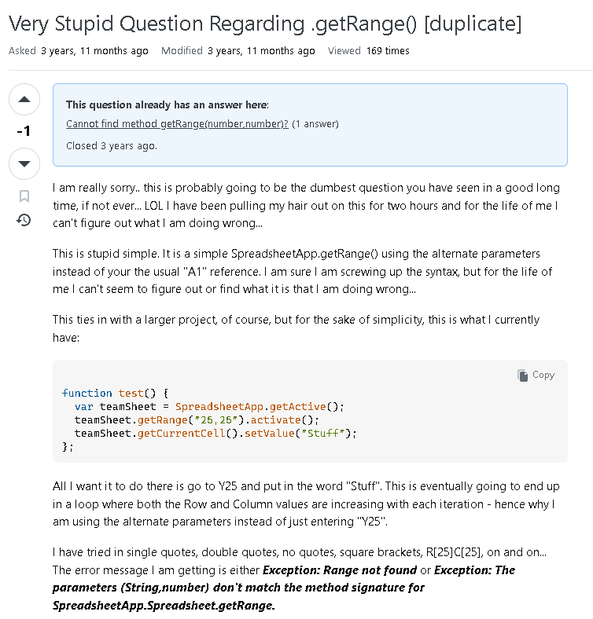
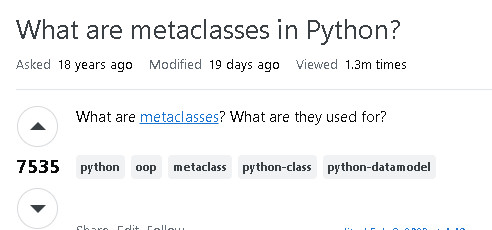

**Is there such thing as a stupid question?**

From my past experience, and after reading Eric S. Raymond's article <a href="http://www.catb.org/esr/faqs/smart-questions.html" target="_blank">How To Ask Questions The Smart Way</a>, I believe there is such a thing as a stupid question. During my contract in the military, my higher-ups always told their junior Marines to look it up before asking. It meant doing your research and having some knowledge of the answer before you opened your mouth. That advice matters even more on an open source forum on the internet, where everyone can see what you wrote. The more vague your question is, the more vague the answer will be, if you get one at all.

<small>The question started off on the wrong foot</small>

A smart question is one that comes from a real thirst for knowledge about something you have not learned yet, asked after you have done your due diligence to find the answer yourself. This question fails that test at the start. The title says nothing about the actual problem, and the post opens with two paragraphs of apologizing: "this is probably going to be the dumbest question you have seen in a good long time" and "I have been pulling my hair out on this for two hours." With thousands of people scrolling Stack Overflow, most of them will not click on a thread that starts like that. The asker made up for it toward the end by posting code and the exact errors, but by then the hook has already turned people away.

The results show it. The question was downvoted to -1, it was closed as a duplicate of an older question, and after nearly four years it had collected only 169 views and no answer of its own.

**What’s a smart question?**

<small>A very simple and straight forward question</small>

As the screenshot above shows, this question has many upvotes. It is direct, straightforward and simple. You could argue that it sits on the borderline of a stupid question, but the topic is a technical term that anyone could be thrown off by, so it is open to interpretation.

**Conclusion**

When we rely on other people's generosity and expertise to answer our questions, the question we ask should be one that leads to efficient and effective help. It should benefit us, the people we ask, and anyone who runs into the same problem later. So if you have a question, make it a smart one. Asking questions will not always get you the best answer, but asking in a way that makes other people want to answer will improve your chances of a good solution and make the experience a positive one on all sides.

**A note on AI use**
I wrote this essay myself. I used Claude to check my spelling and grammar, fix my HTML tags, and suggest where to add more detail about the two questions.
