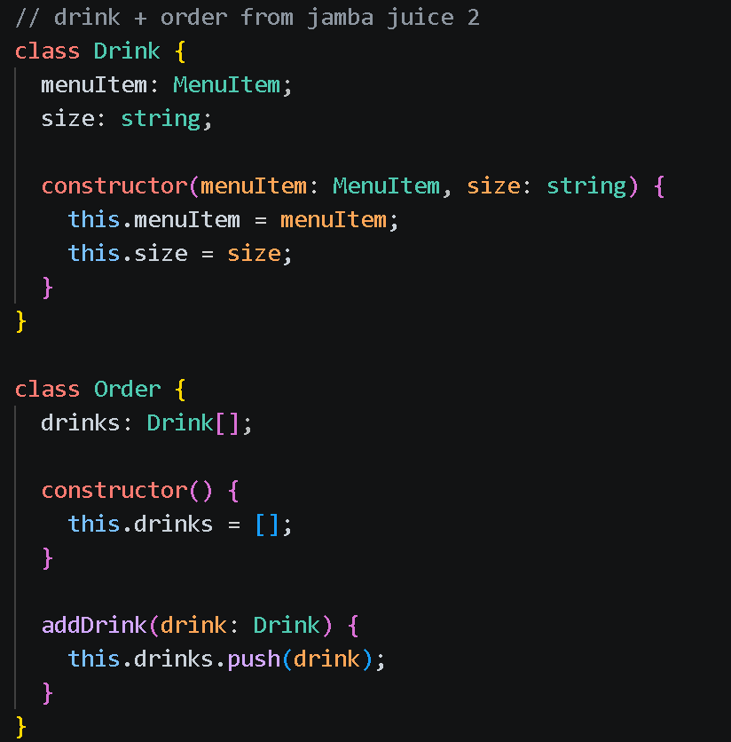

<small>Jamba Juice 2 code</small>

This reminded me of ICS 485 Video Game Design and ICS 369, where each assignment functioned as a building block toward a larger program. It was interesting to see how a simple block of code could be extended into something far more sophisticated than where it started.
